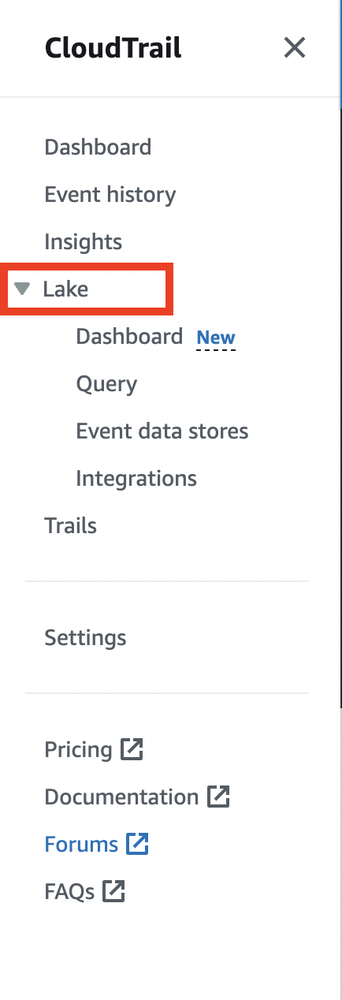
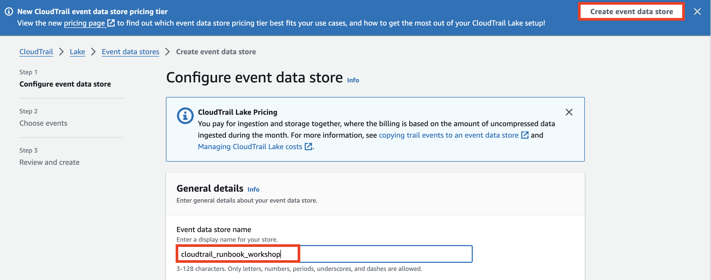
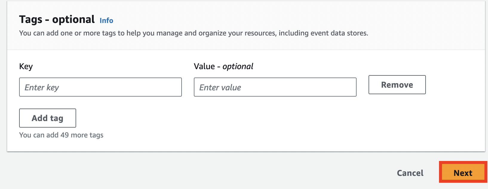
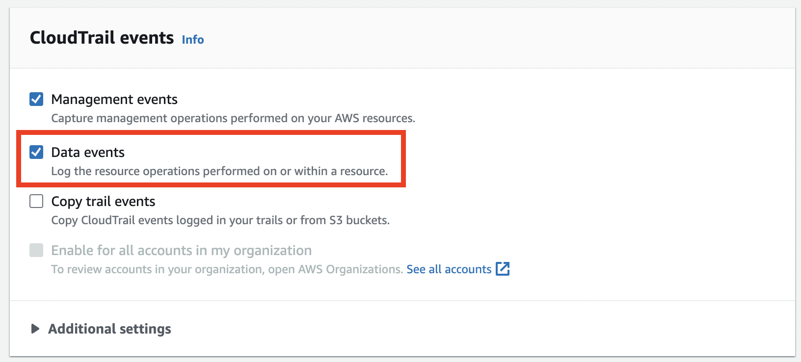
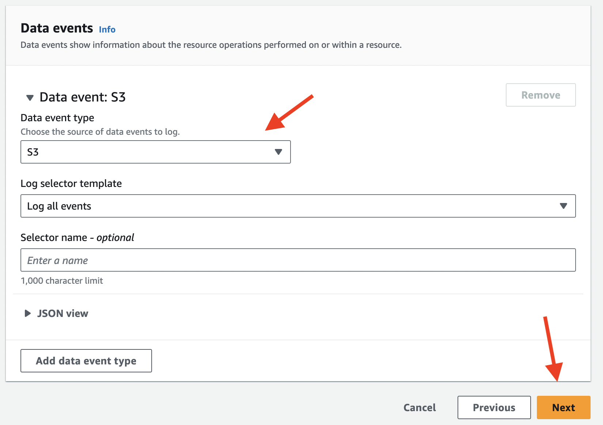
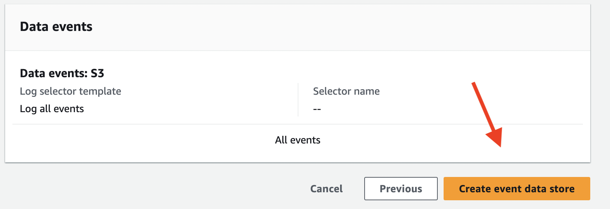

### Tạo Event Data Store trong CloudTrail Lake
1. Điều hướng đến [Cloudtrail console](https://us-east-1.console.aws.amazon.com/cloudtrail/home?region=us-east-1#/dashboard)
2. Trên thanh điều hướng bên trái, Chọn **Lake**

3. Chúng ta sẽ ở trong tab **Event data stores** trong Lake.
4. Chọn nút **Create event data store.**
5. Đặt tên cho  Event data store của bạn là `cloudtrail_runbook_workshop`.

6. Giữ nguyên khoảng thời gian giữ lại mặc định và các tùy chọn mặc định trong Bước 1. Chọn **Next**.

7. Trong bước chọn events, chọn hộp kiểm **Data events**.
8. Giữ nguyên cài đặt mặc định của Management events.

9. Trong phần Data events, chọn drop cho **Data event type**.
10. Chọn **S3**
11. Sau đó chọn **Next** như hình dưới đây

12. Giữ nguyên cài đặt mặc định cho bước 3 và chọn **Create event data store.**

13. Bạn đã tạo thành công lưu trữ dữ liệu sự kiện CloudTrail Lake của mình và có thể tiếp tục bước tiếp theo. 