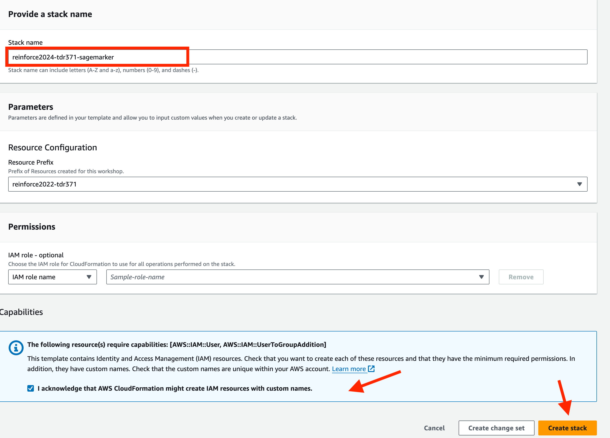
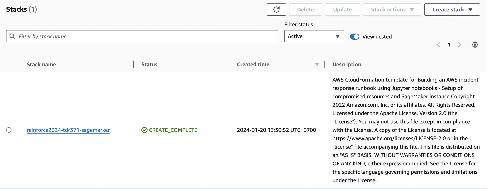

### Thiết lập Amazon SageMaker và mô phỏng cuộc tấn công
Chúng ta cần triển khai AWS CloudFormation templates để thiết lập Amazon SageMaker và các nguồn tài nguyên để mô phỏng các cuộc tấn công.

1. CLick [tại đây](https://us-east-1.console.aws.amazon.com/cloudformation/home?region=us-east-1#/stacks/create/review?templateURL=https://sa-security-specialist-workshops-us-east-1.s3.amazonaws.com/ir-runbook/runbook-simulation-resources-setup.yaml) để mở bảng điều khiển AWS CloudFormation để triển khai AWS CloudFormation stack đầu tiên.
2. Phải chọn một stack name duy nhất cho account của bạn.
3. Chọn **Capabilities** và sau đó bấm **Create Stack**. Việc triển khai stack này sẽ mất khoảng 8 phút; trong khi nó đang triển khai, chúng ta sẽ tìm hiểu sâu hơn về workshop và cách các mô phỏng và cuộc điều tra hoạt động.

4. Bây giờ, bộ cấu hình SageMaker và mô phỏng tấn công CloudFormation sẽ bắt đầu tạo nguồn tài nguyên trong tài khoản của bạn, bạn có thể kiểm tra điều này trên [CloudFormation console](https://console.aws.amazon.com/cloudformation/home?region=us-east-1#/stacks). Khi bộ cấu hình hoàn tất, nó sẽ hiển thị trạng thái **CREATE_COMPLETE**.

Bạn không cần phải đợi đến khi bộ cấu hình hoàn tất để tiếp tục.
