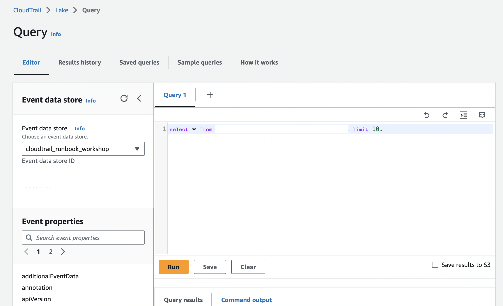
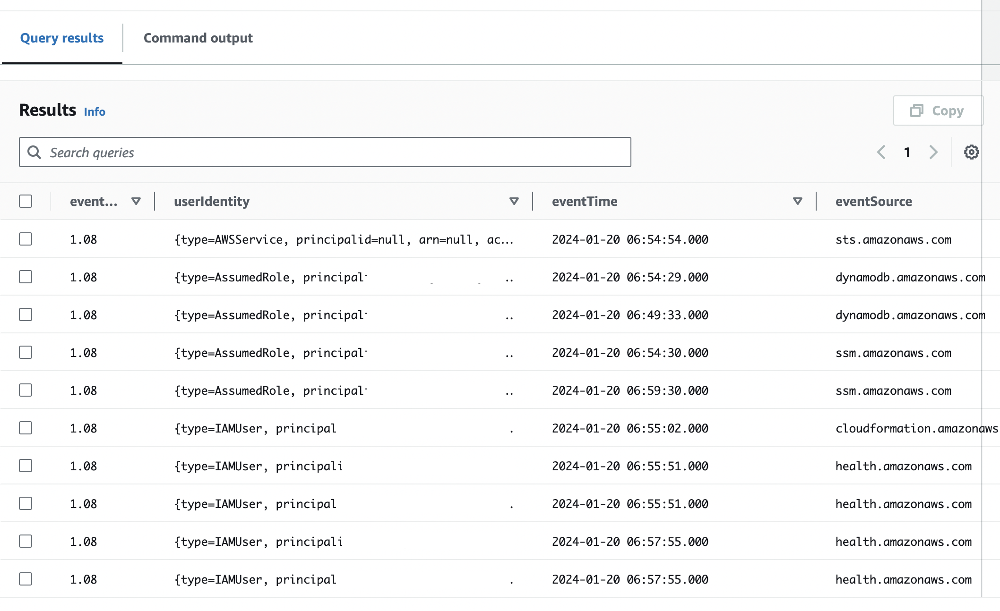

### AWS CloudTrail log fields
Trước khi bắt đầu workshop, đáng để dành một chút thời gian để hiểu rõ các trường và kiểu dữ liệu khác nhau có sẵn để phân tích. Bạn có thể sử dụng những trường này trong các truy vấn để lọc dữ liệu có liên quan đến cuộc điều tra, giảm nhiễu không cần thiết.

Danh sách này không phải là toàn diện và bao gồm một số trường mà có thể hữu ích trong workshop này. Để biết thông tin chi tiết về tất cả các trường có sẵn, hãy tham khảo [tài liệu CloudTrail Record Contents](https://docs.aws.amazon.com/awscloudtrail/latest/userguide/cloudtrail-event-reference-record-contents.html).

| Tên trường | Mô tả |
| --- | --- |
| eventTime | Ngày và giờ của sự kiện theo giờ UTC/Zulu |
| eventVersion | Phiên bản của định dạng nhật ký sự kiện, mới nhất là 1.08 |
| userIdentity | Thông tin về danh tính đã thực hiện yêu cầu |
| eventSource | Dịch vụ mà yêu cầu được thực hiện, thường là servicename.amazonaws.com nhưng có một số ngoại lệ như Amazon CloudWatch là monitoring.amazonaws.com |
| eventName | Hành động được yêu cầu, một trong những hành động của API cho eventSource |
| awsRegion | Khu vực AWS mà yêu cầu được thực hiện |
| sourceIpAddress | Địa chỉ IP mà yêu cầu được thực hiện từ. Nếu thông qua bảng điều khiển, đây là tài nguyên cơ bản chứ không phải máy chủ web bảng điều khiển |
| userAgent | Agent thực hiện yêu cầu, điều này có thể là bảng điều khiển AWS, SDK, CLI |
| errorCode | Mã lỗi được báo cáo bởi dịch vụ gọi của AWS, nếu có |
| errorMessage | Thông báo lỗi được báo cáo bởi dịch vụ gọi của AWS, nếu có |
| requestParameters | Bất kỳ tham số nào được gửi cùng với yêu cầu |
| responseElements | Phản hồi cho các hành động tạo ra sự thay đổi nếu thành công |
| additionalEventData | Dữ liệu bổ sung không thuộc phần của yêu cầu hoặc phản hồi |
| requestID | GUID mỗi yêu cầu được tạo bởi dịch vụ được gọi |
| eventID | GUID mỗi sự kiện được tạo bởi Amazon CloudTrail |
| eventType | Loại yêu cầu được thực hiện, có thể là AwsApiCall AwsServiceEvent, AwsConsoleAction hoặc AwsConsoleSignI |
| apiVersion | Phiên bản của API liên quan đến AwsApiCall từ sự kiện |
| managementEvent | Giá trị Boolean để xác định xem sự kiện có phải là sự kiện quản lý hay không |
| readOnly | Đúng hoặc sai tùy thuộc vào thao tác chỉ được đọc hay không |
| resources | Danh sách các tài nguyên được truy cập trong sự kiện như ARNs, ID tài khoản hoặc bộ nhận dạng loại tài nguyên |
| recepientAccountId | ID tài khoản AWS đã nhận sự kiện có thể khác với ID tài khoản khi truy cập nhiều tài khoản |
| serviceEventDetails | Nếu eventType là AwsServiceEvent, điều này chứa thông tin về sự kiện đó |
| sharedEventId | GUID được tạo bởi Amazon CloudTrail để xác định các sự kiện từ cùng một hành động được gửi đến nhiều tài khoả |
| vpcEndpointId	 | Xác định điểm cuối VPC trong đó các yêu cầu được thực hiện từ VPC đến dịch vụ khác |
| eventCategory | Danh mục của sự kiện như Management, Data, hay Insight |

### AWS CloudTrail Lake Queries
Trước khi bắt đầu điều tra, bạn sẽ thực hiện một truy vấn trong bảng điều khiển CloudTrail Lake để xác nhận cấu hình.
1. Chuyển đến [CloudTrail console](https://us-east-1.console.aws.amazon.com/cloudtrail/home?region=us-east-1#/dashboard).
2. Chọn **Lake** trong bảng điều khiển bên trái.
3. Trong Editor tab, đảm bảo rằng kho lưu trữ dữ liệu mới của bạn được liệt kê. Nên nhìn giống như sau:

4. Trong cửa sổ truy vấn, dán vào `select * from EDS_ID limit 10`
5. Trong câu truy vấn đó, dán ID kho lưu trữ dữ liệu sự kiện của bạn vào chỗ của `EDS_ID`. ID kho lưu trữ dữ liệu sự kiện được liệt kê trong menu bên trái dưới Event data store.
6. Chọn **Run**
7. Khi trạng thái là "Successful", chọn **Query results** tab. Bạn sẽ thấy 10 sự kiện CloudTrail trong tab này.

Bây giờ bạn đã hiểu cách CloudTrail Lake hoạt động, chúng ta sẽ đi qua và hướng dẫn cách truy vấn CloudTrail Lake một cách tự động và xem kết quả một cách linh hoạt.

