### Khởi động Jupyter
1. Di chuyển đến AWS SageMaker console
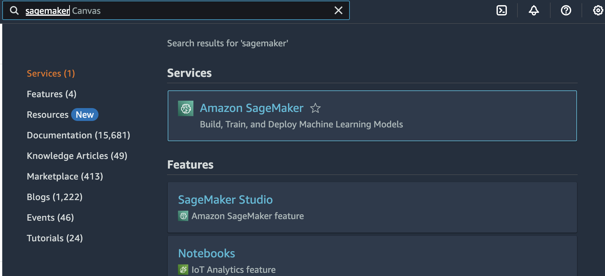
2. Từ menu bên trái, chọn **Notebook** sau đó chọn **Notebook instances**
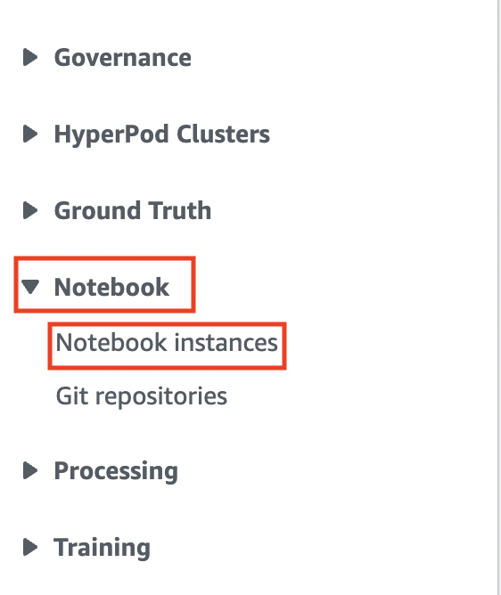
3. Bảng điều khiển sẽ hiển thị SageMaker notebook instance của bạn, ở phía bên phải của trang, click vào liên kết **Open Jupyter**
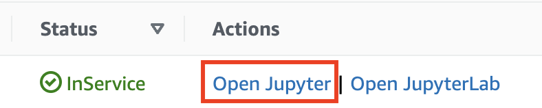
4. Tải xuống [this IAM Jupyter notebook](https://sa-security-specialist-workshops-us-east-1.s3.amazonaws.com/ir-runbook/IAM+Investigation.ipynb)
5. Tải xuống [this EC2 Jupyter notebook](https://sa-security-specialist-workshops-us-east-1.s3.amazonaws.com/ir-runbook/EC2+Investigation.ipynb)
6. Khi Jupyter mở, click vào **Upload** ở phía trên bên phải màn hình
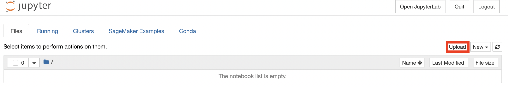
7. Chọn hai Jupyter notebooks bạn đã tải xuống và sau đó click vào nút **Upload** màu xanh.
8. Khởi chạy IAM investigation Jupyter notebook bằng cách click vào tên từ danh sách notebook
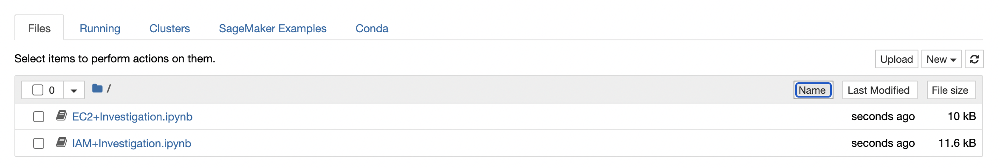
### Điều hướng Jupyter
Jupyter notebook trông tương tự như thế này
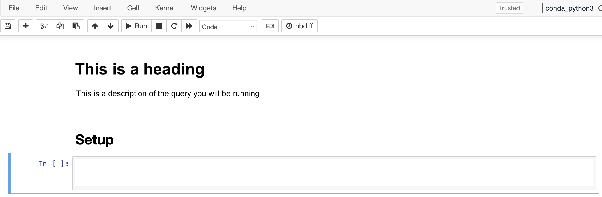
Jupyter hoạt động bằng cách thực thi mã trong từng ô, ví dụ này cho thấy ba ô. Ô đầu tiên là tiêu đề và ô thứ hai là trường văn bản cho ý kiến/ mô tả, cả hai đều sử dụng Markdown nếu bạn muốn thêm định dạng. Ô thứ ba là một khối mã, trong trường hợp này là SQL.

Khi tạo truy vấn, bạn có thể thêm một ô mới hoặc cập nhật ô hiện tại với truy vấn mới. Lợi ích của việc thêm một ô mới là bạn giữ được đầu ra của bất kỳ truy vấn nào đã chạy trước đó trong Jupyter notebook để sử dụng sau này.

Ở đầu của notebook, hàng đầu tiên là menu "File" của bạn, hàng thứ hai có các nút sau (từ trái sang phải)

1. Save - khi bạn làm việc qua workshop, bạn nên lưu bất kỳ thay đổi nào bạn thực hiện vào Jupyter notebook của mình
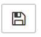
2. Thêm ô mới dưới ô hiện tại 
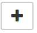
3. Cut, Copy, Paste
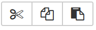
4. Di chuyển ô up hoặc down
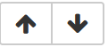
5. Run - điều này thực thi ô mã hiện tại được chọn
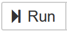
6. Stop - điều này dừng mã đang thực thi hiện tại 

7. Restart - điều này khởi động lại notebook, bạn sẽ không cần sử dụng nó trong workshop này
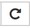
8. Restart and run - điều này khởi động lại notebook, sau đó tự động chạy mọi ô mã. Bạn sẽ không cần sử dụng nó trong workshop này

9. Cell type - cho workshop này là Markdown hoặc Code 
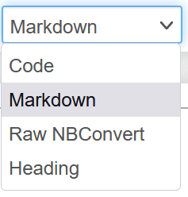
Khi bạn làm việc qua workshop, hãy thoải mái thêm nhiều ô nếu bạn muốn cho code hoặc comments, làm cho Jupyter notebook trở nên thuận tiện với bạn!

### Loading libraries
Code đầu tiên trong Jupyter notebook thiết lập các thư viện bạn sẽ cần. Ô này cài đặt gói boto3 (hay còn gọi là SDK AWS cho Python), pandas (một công cụ phân tích dữ liệu cho Python), những thư viện này cho phép bạn truy vấn CloudTrail Lake và tương tác trực tiếp với các nguồn tài nguyên AWS từ Jupyter notebook. Ô cũng đặt chiều rộng cột tối đa để dễ đọc dữ liệu đầu ra và đặt biến vùng (region variable) thành us-east-1.

1. Chọn dòng code đầu tiên
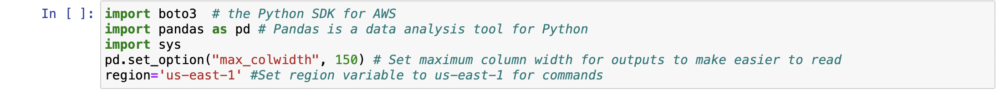
2. Click vào **Run**

Sau khi bạn đã làm điều này, bạn sẽ thấy số [1] ở ô thay đổi thành [*] có nghĩa là mã đang được thực thi. Đầu ra cho các lệnh này sau đó sẽ hiển thị trong notebook. Khi ô đã hoàn thành việc thực thi, [*] sẽ chuyển lại thành [1] và Jupyter sẽ tự động chọn ô tiếp theo