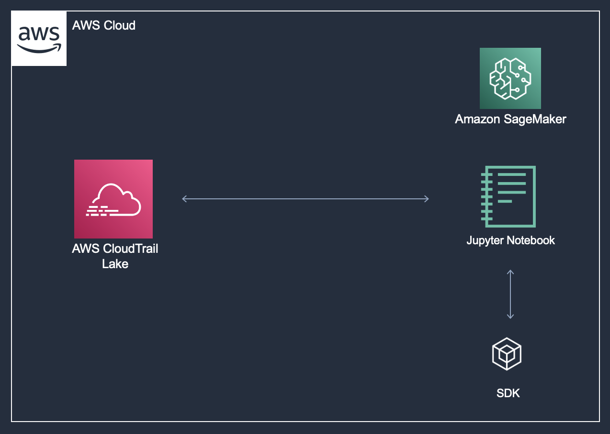

### Architecture
Trong tài khoản AWS của bạn trên Event Engine, AWS CloudTrail Lake đã được cấu hình. CloudTrail Lake cho phép truy vấn dữ liệu CloudTrail bằng cách sử dụng SQL tiêu chuẩn. Trong workshop này, bạn sẽ truy vấn chúng từ Jupyter notebook chạy trên một instance Amazon SageMaker t2.medium, sử dụng SQL tiêu chuẩn ANSI. Kết quả của các truy vấn này được báo cáo trở lại Jupyter notebook để phân tích tiếp theo. Bạn cũng sẽ gửi các cuộc gọi SDK Python bằng thư viện boto3 để kiểm soát sự cố.

### Architecture Diagram

### Những dịch vụ AWS đã sử dụng
**AWS CloudTrail Lake**
[AWS CloudTrail Lake](https://docs.aws.amazon.com/awscloudtrail/latest/userguide/cloudtrail-lake.html) là một hệ thống lưu trữ dữ liệu quản lý, cho phép tổ chức tập hợp, lưu trữ không thể thay đổi và truy vấn sự kiện được ghi lại bởi CloudTrail để kiểm toán, điều tra bảo mật và sửa chữa sự cố vận hành. Nền tảng mới này đơn giản hóa các luồng công việc phân tích CloudTrail bằng cách tích hợp việc thu thập, lưu trữ, chuẩn bị và tối ưu hóa cho phân tích và truy vấn trong cùng một sản phẩm. Điều này loại bỏ nhu cầu duy trì các đường ống xử lý dữ liệu riêng lẻ kéo dài qua các nhóm và sản phẩm để phân tích sự kiện CloudTrail.

**Amazon SageMaker**
[Amazon SageMaker](https://docs.aws.amazon.com/sagemaker/latest/dg/whatis.html) là một dịch vụ ML toàn diện. Trong workshop này, bạn sẽ sử dụng Amazon SageMaker để lưu trữ cuốn sách chạy phản ứng sự cố của mình dưới dạng Jupyter notebook. Điều này giúp quản lý ứng dụng Jupyter một cách đơn giản, vì tất cả được quản lý bởi instance Amazon SageMaker. Amazon SageMaker hỗ trợ Git một cách tự nhiên, cho phép bạn quản lý cuốn sách chạy phản ứng sự cố của mình bằng cách sử dụng Git repo để duy trì kiểm soát phiên bản và tăng cường sự cộng tác.

**Jupyter notebooks**
[Jupyter notebooks](https://docs.aws.amazon.com/sagemaker/latest/dg/nbi.html) là một ứng dụng web mã nguồn mở hỗ trợ hơn 100 ngôn ngữ khác nhau (gọi là kernels), bao gồm Python và SQL. Jupyter notebooks lý tưởng cho phản ứng sự cố, bạn có thể có mã nguồn thực, phương trình toán, trực quan hóa (bao gồm HTML, hình ảnh và video) và văn bản trình bày trong Jupyter notebook của mình, tạo ra một nguồn tài nguyên duy nhất để sử dụng, loại bỏ nhu cầu cho 100s kịch bản khác nhau để đạt được yêu cầu phản ứng sự cố của bạn.