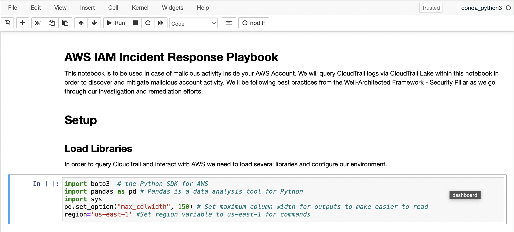
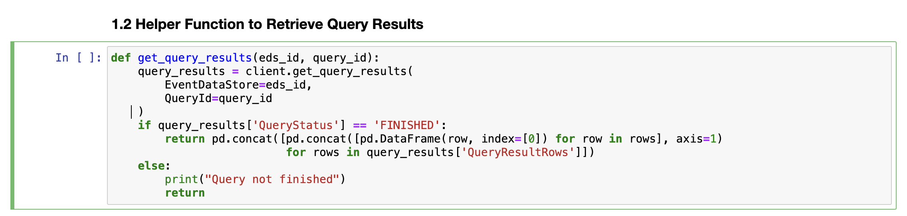
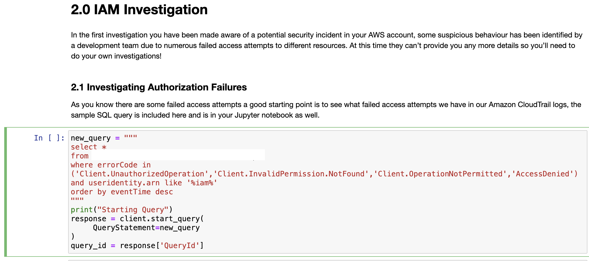
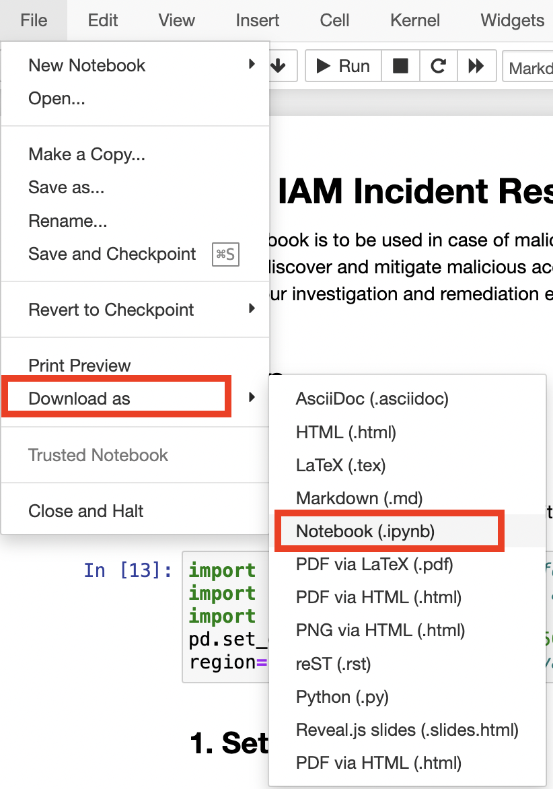

{}
Nếu bạn không sử dụng Event Engine, vui lòng đảm bảo tất cả các mẫu CloudFormation đã triển khai thành công và bạn đã đợi ít nhất 15 phút để tạo nhật ký CloudTrail
{}

### Giới thiệu
Trong cuộc điều tra đầu tiên, bạn đã biết được về một sự kiện bảo mật tiềm ẩn trong tài khoản AWS của bạn, một số hành vi đáng ngờ đã được đội phát triển phát hiện khi họ thấy một đợt tăng đột ngột trong số lần đăng nhập không thành công trên một trong các bảng điều khiển của họ vào sáng nay. Tại thời điểm này, họ không thể cung cấp thêm chi tiết nào khác cho bạn, vì vậy bạn sẽ cần tiến hành cuộc điều tra của riêng mình!

### Event data store ID trong queries
Bạn sẽ chạy và xây dựng các truy vấn để điều tra sự cố IAM và sự cố EC2. **Hãy đảm bảo bạn thay thế** `EDS_ID` **sự thật tế của bạn ở CloudTrail Lake Event data store ID**.

### Bước 1 - Thiết lập CloudTrail Lake
Bạn sẽ bắt đầu bằng cách chạy ba khối mã đầu tiên của notebook. Nhấn vào 3 khối mã đầu tiên như hình dưới đây rồi click vào **Run**




### Bước 2 - Investigation
### 2.1 Investigating Lỗi Ủy quyền
**2.1.1 Xây dựng Truy vấn**

Như bạn đã biết có một số lần đăng nhập không thành công nhưng không có thông tin nào khác, bạn sẽ cần thực hiện một số hoạt động khám phá trước hết.

Trước tiên, bạn nên khám phá bất kỳ cố gắng truy cập không thành công nào chúng ta có trong AWS CloudTrail logs của bạn bằng cách sử dụng truy vấn SQL mẫu được bao gồm ở đây. Bạn cũng có thể tìm thấy truy vấn này trong Jupyter notebook của bạn ở phần 2.1.

Trong truy vấn này, bạn sẽ truy vấn tất cả các trường, tìm kiếm các mã lỗi cụ thể như AccessDenied và lọc bất kỳ điều gì là thực thể IAM của AWS bằng cách tìm kiếm `useridentity.arn như '%iam%'`. Các mục sau đó sẽ được sắp xếp theo `eventTime`. Hãy đảm bảo bạn dán `ID EDS` thực tế của mình vào nơi giữ chỗ `EDS_ID`, sau đó chạy code.

**2.1.2 Thực hiện Truy vấn**
1. Đảm bảo bạn đã dán **EDS_ID** ở mục 1.1 của mình vào truy vấn.

2. Chạy ô truy vấn.
3. Chạy ô kết quả. **Lưu ý: bạn có thể cần khoảng 30 giây để truy vấn hoàn tất.**


**2.1.3 Phân tích Kết quả**

**Các sự cố xác thực nào đã xảy ra?**

**2.2 Điều tra về User Identities có Authorization Failures**
**2.2.1 Xây dựng Truy vấn**
Giống như trước đó, có rất nhiều dữ liệu ở đây để bạn cố gắng hiểu rõ. Bạn có thể thấy có một số lỗi `AccessDenied` và `Client.UnauthorizedOperation` nhưng bạn cần phát triển truy vấn thêm.

Điều hữu ích ở đây là lấy số lượng của các thực thể AWS IAM đang tạo ra tất cả các yêu cầu này và sau đó nhóm chúng lại. Việc sử dụng câu lệnh `count` và `groupby` trong truy vấn của bạn sẽ là một điểm bắt đầu tốt. Bạn có thể tạo một ô mới trong Jupyter notebook hoặc ghi đè ô hiện tại.

 Xem gợi ý ở đây!
```
select userIdentity.arn, count(*) as total
    from EDS_ID
    where errorCode in ('Client.UnauthorizedOperation','Client.InvalidPermission.NotFound','Client.OperationNotPermitted','AccessDenied')
    and useridentity.arn like '%iam%'
    group by userIdentity.arn
    order by total desc
```

**2.2.2 Chạy Truy vấn**
1. Đảm bảo bạn dán `EDS_ID` của mình vào truy vấn.
2. Chạy ô truy vấn.
3. Chạy ô kết quả. **Lưu ý: bạn có thể cần khoảng 30 giây để truy vấn hoàn tất.**

**2.2.3 Phân tích Kết quả**
ARN(s) của thực thể AWS IAM gây ra hành vi đáng ngờ là gì?

Lưu ý: ARNs cho AWS IAM có định dạng `'arn:aws:iam::account-id:resource-type/resource-name'`

Bây giờ bạn có thể xem xét thực thể AWS IAM nào tạo ra phần lớn các cuộc gọi trái phép, cũng có một số khác trong đó chỉ tạo ra một vài cuộc gọi nhưng tập trung của bạn nên là vào các cuộc gọi được sử dụng nhiều lần nhất.

**2.3 Điều tra về Suspicious Identity**
**2.3.1 Xây dựng Truy vấn**
Bây giờ bạn đã xác định được thực thể AWS IAM có thể đã bị xâm phạm, bạn nên tiến hành các cuộc điều tra tiếp theo để xác định thực thể đã cố gắng làm gì.

Bạn có thể bắt đầu bằng một truy vấn đơn giản sử dụng ARN bạn đã xác định trong bước trước để hạn chế tìm kiếm.
Xem gợi ý dưới đây!
```
select *
from EDS_ID
where userIdentity.arn='arn:aws:iam::account-id:resource-type/resource-name'
```

**2.3.2 Chạy Truy vấn**
1.Đảm bảo bạn dán `EDS_ID` của mình vào truy vấn.
2.Chạy ô truy vấn.
3. Chạy ô kết quả. **Lưu ý: bạn có thể cần khoảng 30 giây để truy vấn hoàn tất.**

**2.3.3 Phân tích Kết quả**
Những hành động nào mà người dùng có vẻ đã bị thâm nhập có thể thực hiện được?

**2.4 Điều tra về Các Dịch vụ AWS được Sử Dụng bởi Suspicious Identity**
**2.4.1 Xây dựng Truy vấn**
Một lĩnh vực khác để điều tra là count và group lại các điểm cuối dịch vụ AWS mà các cuộc gọi đang được thực hiện đến, để bạn có thể xem xét những dịch vụ nào đang được liệt kê bởi thực thể IAM.

Xem gợi ý dưới đây!
```
select eventSource, count(*) as total
    from EDS_ID
    where userIdentity.arn='arn:aws:iam::account-id:resource-type/resource-name'
    group by eventSource
    order by total desc
```
**2.4.2 Chạy Truy vấn**
1. Đảm bảo bạn dán **EDS_ID** và **userIdentity.arn** vào truy vấn.
2. Chạy ô truy vấn.
3. Chạy ô kết quả. **Lưu ý: bạn có thể cần khoảng 30 giây để truy vấn hoàn tất.**

**2.4.3 Phân tích Kết quả**
Những dịch vụ AWS nào đang là mục tiêu bởi Suspicious Identity?

**2.5 Điều tra về Hành động được thực hiện bởi Suspicious Identity**
**2.5.1 Xây dựng Truy vấn**
Bây giờ bạn biết các điểm cuối dịch vụ AWS, một cuộc điều tra hữu ích khác là xem xét những cuộc gọi nào đang được thực hiện đến những điểm cuối đó, để có thêm thông tin về những gì thực thể IAM đang cố gắng thực hiện.

Xem gợi ý dưới đây!
```
select eventName, count(*) as total
    from EDS_ID
    where userIdentity.arn='arn:aws:iam::account-id:resource-type/resource-name'
    group by eventName
    order by total desc
```

**2.5.2 Chạy Truy vấn**
1. Đảm bảo bạn dán **EDS_ID** và **userIdentity.arn** vào truy vấn.
2. Chạy ô truy vấn.
3. Chạy ô kết quả. **Lưu ý: bạn có thể cần khoảng 30 giây để truy vấn hoàn tất.**

**2.5.3 Phân tích Kết quả**
Những hành động AWS nào đang là mục tiêu bởi suspicious identity?

### 2.6 Tổng hợp Tất cả
**2.6.1 Xây dựng Truy vấn**
Tổng hợp các truy vấn trước đó để tạo một truy vấn duy nhất hiển thị tên sự kiện, dịch vụ AWS và khu vực AWS nơi các yêu cầu đang được thực hiện bởi thực thể AWS IAM bị xâm nhập.

Xem gợi ý dưới đây!
```
select eventName, count(*) as total, eventSource, awsRegion
    from EDS_ID
    where userIdentity.arn='arn:aws:iam::account-id:resource-type/resource-name'
    group by eventName, eventSource, awsRegion
    order by total desc
```

**2.6.2 Chạy Truy vấn**
1. Đảm bảo bạn dán **EDS_ID** và **userIdentity.arn** vào truy vấn.
2. Chạy ô truy vấn.
3. Chạy ô kết quả. **Lưu ý: bạn có thể cần khoảng 30 giây để truy vấn hoàn tất.**

**2.6.3 Phân tích Kết quả**
Hành động, mục tiêu và khu vực AWS nào đang là mục tiêu bởi hành vi đáng ngờ?

### Bước 3 - Chính sách ngăn chặn
Để ngăn chặn việc sử dụng thực thể AWS IAM, bạn nên tắt tài khoản người dùng AWS IAM đã bị xâm nhập để ngăn chặn cuộc tấn công. Đầu tiên, bạn sẽ muốn kiểm tra xem các khóa không được sử dụng cho các quy trình sản xuất. Chúng ta biết rằng tài khoản người dùng AWS IAM không tạo bất kỳ vai trò hoặc thực thể AWS IAM bổ sung nào nên bạn chỉ cần tắt một tài khoản.

**Bước 3.1 Xác định ID Khóa Truy Cập**
Tiếp theo, bạn cần xác định useridentity.accesskeyid(s) để biết khóa truy cập nào bạn muốn tắt.

Xem gợi ý dưới đây!
```
select useridentity.accesskeyid, count(*) as total
    from EDS_ID
    where userIdentity.arn='arn:aws:iam::account-id:resource-type/resource-name'
    group by useridentity.accesskeyid
    order by total desc
```
**Những ID khóa truy cập mà bạn cần tắt là gì?**

### Bước 3.2 Vô hiệu hóa Khóa Truy Cập
Bây giờ bạn đã có ID khóa truy cập, thay thế chuỗi `'KEYID'` và `'USERNAME'`bằng các giá trị đó. Mã này sử dụng SDK Python boto3 và sẽ vô hiệu hóa ID khóa truy cập đó cho người dùng cụ thể.

```
access_key_to_deactivate='KEYID'
username='USERNAME'
iam = boto3.resource('iam', region_name=region)
access_key = iam.AccessKey(username,access_key_to_deactivate)
response_status = access_key.deactivate()
status_code = response_status['ResponseMetadata']['HTTPStatusCode']
if status_code == 200:
    print("Key Disabled Successfully")
else:
    print("Key deactivation failed")
```

### Bước 3 - Gắn Chính Sách Từ Chối Tất Cả
Cuối cùng, bạn nên áp dụng một chính sách nội tuyến cho tài khoản người dùng AWS IAM sẽ từ chối tất cả các hành động một cách rõ ràng để ngăn chặn việc sử dụng tài khoản đó. Trong mã sau, thay thế `'USERNAME'` bằng tên người dùng của tài khoản để áp dụng chính sách.

```
username='USERNAME'

iam = boto3.client('iam', region_name=region)
response = iam.put_user_policy(UserName=username,PolicyName='Block',PolicyDocument='{"Version":"2012-10-17","Statement":{"Effect":"Deny","Action":"*","Resource":"*"}}')
status_code = response['ResponseMetadata']['HTTPStatusCode']
if status_code == 200:
    print("Policy attached successfully")
else:
    print("Policy attachment failed")
```
### Bước 4 - Tải xuống Notebook

1. Chọn **File**, sau đó chọn **Download as**, tiếp đó chọn **Notebook (.ipynb)**. Điều này phục vụ để làm bằng chứng cho cuộc điều tra của bạn.


### Bước 5 - Kết luận
Bạn đã thành công trong việc:

1. Thực hiện các hoạt động phát hiện và điều tra về các cố gắng đăng nhập không thành công được báo cáo.
2. Xác định tài khoản người dùng AWS IAM bị xâm nhập và tìm ra các hành động mà nó đã cố gắng thực hiện.
3. Vô hiệu hóa các khóa truy cập được sử dụng bởi tài khoản người dùng AWS IAM bị xâm nhập và áp dụng một chính sách từ chối tất cả một cách rõ ràng.

**Những bước nào có thể đã được thực hiện để ngăn chặn việc sử dụng các khóa truy cập?**

Nhấp để xem câu trả lời!
Tập trung quản lý danh tính bằng cách sử dụng SSO hoặc federation

Giả định vai trò bằng cách sử dụng Amazon STS để có thông tin đăng nhập tạm thời

Triển khai MFA cho việc đăng nhập
