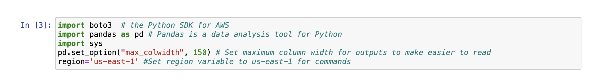
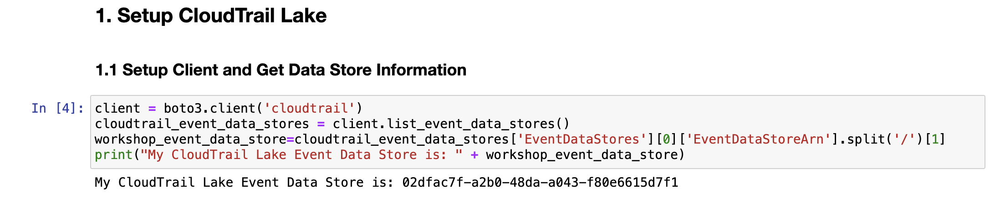
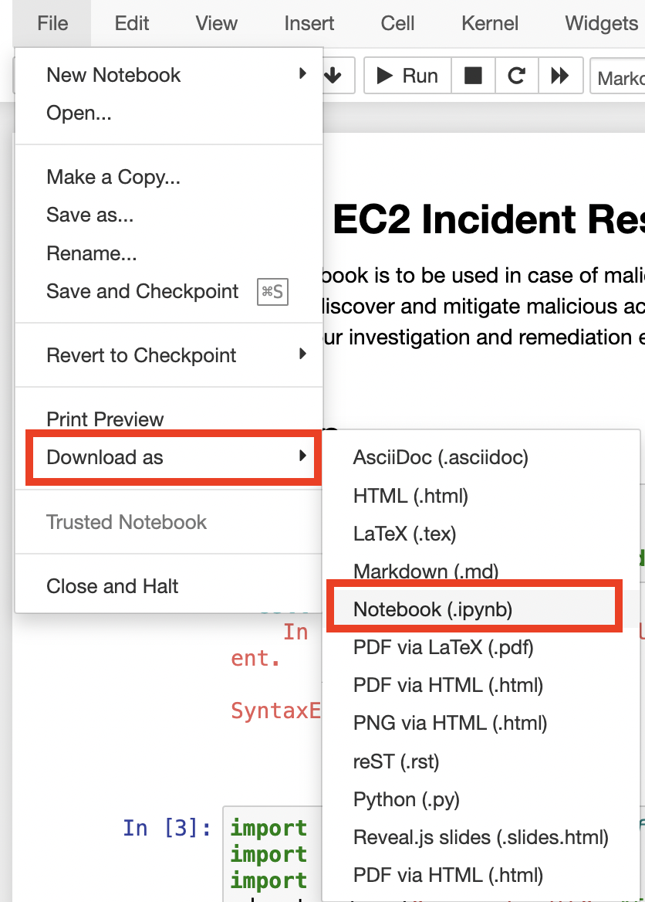

{}
Nếu bạn không sử dụng Event Engine, vui lòng đảm bảo tất cả các mẫu CloudFormation đã triển khai thành công và bạn đã đợi ít nhất 15 phút để tạo nhật ký CloudTrail
{}

### Giới thiệu
Trong cuộc điều tra thứ hai, bạn đã biết đến một sự kiện an ninh tiềm ẩn trong tài khoản AWS của bạn, một số hành vi đáng ngờ đã được đội kỹ thuật nhận thức với một trường hợp Amazon EC2 instance cố gắng truy cập các tài nguyên mà nó không có quyền truy cập. Tại thời điểm này, họ không thể cung cấp thêm chi tiết nào, nên bạn cần thực hiện cuộc điều tra của riêng mình!

### Bước 1 - Thiết lập CloudTrail Lake
Bạn sẽ bắt đầu bằng cách chạy ba khối mã đầu tiên của sổ ghi chú. Xem dưới đây để biết cách chạy những ô đó.



### Bước 2 - Ivestigation
**2.1 Điều tra việc Listing Bucket Amazon S3 của Amazon EC2 Instance**
**2.1.1 Xây dựng Truy vấn**
Như bạn đã biết, có một số instance Amazon EC2 đáng ngờ, bước đầu tiên là cố gắng xác định xem có bất kỳ instance nào thực hiện các hoạt động đáng ngờ. Đôi khi điều này sẽ là các hành động khám phá, chẳng hạn như liệt kê các bucket Amazon S3 để cố gắng đánh số tài nguyên trong môi trường của bạn. Điều này không phải là hoạt động bình thường mà bạn mong đợi các instance Amazon EC2 thực hiện.

Truy vấn đầu tiên này cho phép chúng ta xác định các instance đang thực hiện cuộc gọi `ListBuckets` cho Amazon S3, lưu ý rằng điều này được lọc để tìm kiếm một danh tính người dùng `like %:i-` để chỉ tìm kiếm các instance Amazon EC2.
```
select useridentity.principalid, eventsource, eventname, count(*) as total
from EDS_ID
where useridentity.principalid like '%:i-%'
and eventsource = 's3.amazonaws.com'
and eventname = 'ListBuckets'
group by useridentity.principalid, eventsource, eventname
order by total desc
```

**2.1.2 Chạy Truy vấn**
1. Đảm bảo bạn dán **EDS_ID** của mình vào truy vấn.
2. Chạy ô truy vấn.
3. Chạy ô kết quả. **Lưu ý: bạn có thể cần khoảng 30 giây để truy vấn hoàn thành.**

**2.1.3 Phân tích Kết quả**
Instance ID của Amazon EC2 gây ra hành vi đáng ngờ là gì?

### 2.2 Điều tra Hành động được Thực hiện bởi Instance EC2
2.2.1 Xây dựng Truy vấn
Bây giờ bạn đã biết Instance ID, bạn có thể đào sâu một chút để tìm hiểu thêm về những gì instance này đã làm. Sử dụng một truy vấn tương tự như với thực thể IAM của AWS, `count` và `group` theo các cuộc gọi mà instance này đang thực hiện, bạn cũng muốn cập nhật `useridentity.principalid` để là ID của instance từ truy vấn trước đó.

Ví dụ, nếu Instance ID của bạn là `i-0123456789abcdefgh` thì dòng nên đọc `where useridentity.principalid like '%:i-0123456789abcdefgh'`
Xem gợi ý dưới đây!
```
select eventname, count(*) as total
    from EDS_ID
    where useridentity.principalid like '%:<INSTANCE_ID>'
    group by eventname
    order by total desc
```
**2.2.2 Chạy Truy vấn**
1. Đảm bảo bạn dán **EDS_ID** và **instance_id** của mình vào truy vấn.
2. Chạy ô truy vấn.
3. Chạy ô kết quả. **Lưu ý: bạn có thể cần khoảng 30 giây để truy vấn hoàn thành.**
**2.2.3 Phân tích Kết quả**
Cuộc gọi chính mà instance đáng ngờ của bạn đã thực hiện là gì?

### 2.3 Điều tra Cuộc gọi API chỉ Đọc được thực hiện bởi Instance EC2
**2.3.1 Xây dựng Truy vấn**
Bạn cũng có thể thực hiện một số khám phá hơn bằng cách sử dụng cờ chỉ đọc này cho chúng ta một cái nhìn nhanh về cuộc gọi nào đã được thực hiện mà chỉ là đọc, mà không cần bạn phải biết các cuộc gọi cụ thể và xem chúng có cố gắng thực hiện cuộc gọi đọc hay sửa đổi không.

Xem gợi ý dưới đây!
```
select useridentity.principalid, eventsource, eventname, count(*) as total
    from EDS_ID
    where useridentity.principalid like '%:<INSTANCE_ID>'
    and readonly=true
    group by useridentity.principalid, eventsource, eventname
    order by total desc
```

**2.3.2 Chạy Truy vấn**
1. Đảm bảo bạn dán **EDS_ID** và **instance_id** của mình vào truy vấn.
2. Chạy ô truy vấn.
3. Chạy ô kết quả. **Lưu ý: bạn có thể cần khoảng 30 giây để truy vấn hoàn thành.**

**2.3.3 Phân tích Kết quả**
Cuộc gọi chỉ đọc nào mà instance đáng ngờ của bạn đã thực hiện?

### 2.4 Điều tra Cuộc gọi S3 PutObject được Thực hiện bởi Instance EC2
**2.4.1 Xây dựng Truy vấn**
Từ một trong những truy vấn trước đây của bạn, bạn có thể đã nhận thức được rằng instance Amazon EC2 bị chiếm đóng đã thực hiện một số cuộc gọi `PutObject` đến Amazon S3. Hãy điều tra thêm xem instance đã thực hiện cuộc gọi `PutObject` nào đến Amazon S3. Bạn có thể sử dụng trường `requestParameters` để biết một số chi tiết về những gì instance đáng ngờ của bạn đã làm!

 Xem gợi ý dưới đây!
```
select useridentity.principalid, eventname, eventsource, requestparameters
    from EDS_ID
    where useridentity.principalid like '%:<INSTANCE_ID>'
    and eventsource = 's3.amazonaws.com'
    and eventname = 'PutObject'
```

**2.4.2 Chạy Truy vấn**
1. Đảm bảo bạn dán **EDS_ID** và **instance_id** của mình vào truy vấn.
2. Chạy ô truy vấn.
3. Chạy ô kết quả. **Lưu ý: bạn có thể cần khoảng 30 giây để truy vấn hoàn thành.**

**2.4.3 Phân tích Kết quả**
Instance bị chiếm đóng của bạn đã tải lên Amazon S3 những tệp nào?

### 2.5 Tổng hợp tất cả
**2.5.1 Xây dựng Truy vấn**
Tổng hợp các truy vấn trước đó và những gì bạn đã tìm hiểu từ cuộc điều tra đầu tiên, để tạo ra một truy vấn duy nhất hiển thị tên sự kiện và dịch vụ AWS nơi các yêu cầu được thực hiện bởi instance Amazon EC2 bị chiếm đóng.

Xem gợi ý dưới đây!
```
select eventname, count(*) as total, eventsource, awsregion
    from EDS_ID
    where useridentity.principalid like '%:<INSTANCE_ID>'
    group by eventname, eventsource, awsregion
    order by total desc
```
**2.5.2 Chạy Truy vấn**
1. Đảm bảo bạn dán **EDS_ID** và **instance_id** của mình vào truy vấn.
2. Chạy ô truy vấn.
3. Chạy ô kết quả. **Lưu ý: bạn có thể cần khoảng 30 giây để truy vấn hoàn thành.**

**2.5.3 Phân tích Kết quả**
Các hành động, dịch vụ và khu vực AWS mà instance bị chiếm đóng của bạn đã gọi là gì?

### Bước 3 - Chính sách ngăn chặn
Để bảo vệ instance Amazon EC2 và ngăn chặn việc sử dụng tiếp theo, bạn nên đặt nó vào một nhóm bảo mật mới, có giới hạn (thay vì thay đổi nhóm bảo mật hiện tại vì điều này sẽ không kết thúc các phiên hoạt động), và tạo snapshot cho ổ đĩa EBS để điều tra sau này.

Trong mã sau, thay thế `'INSTANCE_ID'` bằng ID của instance Amazon EC2 bị chiếm đóng. Mã Python sẽ tạo ra một bản snapshot của ổ đĩa EBS để điều tra sau này, sau đó tạo ra một nhóm bảo mật mới không có quy tắc truy nhập hoặc truy xuất và gắn nó vào instance. Tiếp theo, nó sẽ loại bỏ nhóm bảo mật cũ để kết thúc bất kỳ phiên hoạt động nào đang hoạt động. Cuối cùng, nó sẽ chấm dứt instance.

Ngay trước khi chấm dứt, có một điều kiện chờ để cho phép chụp ảnh nhanh trước khi chấm dứt phiên bản, vì vậy mã này sẽ mất 40-50 giây để chạy.

**3.1 Snapshot**
import time
instance_id='ENTER INSTANCE ID'
ec2=boto3.resource('ec2')
instance=ec2.Instance(instance_id)
ebs_vol=instance.block_device_mappings[0]['Ebs']['VolumeId']
response=ec2.create_snapshot(VolumeId=ebs_vol)
print(response)

**3.2 Chính sách ngăn chặn**
```
time.sleep(30) # allow snapshot to finish
vpc_id=instance.vpc_id
security_group=instance.security_groups[0]['GroupId']
ec2_client=boto3.client('ec2')
response=ec2_client.create_security_group(
    GroupName='Restricted_Group',
    Description='Restricts_access',
    VpcId=vpc_id
)
restricted_sg=ec2.SecurityGroup(response['GroupId'])
response=restricted_sg.revoke_egress(
    IpPermissions=restricted_sg.ip_permissions_egress
)
response=instance.modify_attribute(Groups=[restricted_sg.id])
instance.terminate()
```

### Bước 4 - Tải xuống Notebook
Chọn **File**, sau đó chọn **Download as**, tiếp đó chọn **Notebook (.ipynb)**. Điều này phục vụ để làm bằng chứng cho cuộc điều tra của bạn.

### Bước 5 - Kết luận
Bạn đã thành công trong việc:

1. Thực hiện các hoạt động khám phá và điều tra cho hoạt động đáng ngờ được báo cáo.
2. Xác định Amazon EC2 instance bị tấn công và tìm hiểu các hành động nó đã thực hiện.
3. Cô lập instance trong một nhóm bảo mật bị hạn chế để ngăn chặn truy cập, tạo một bản snapshot của ổ đĩa Amazon EBS để điều tra trong tương lai, và sau đó chấm dứt instance.

**Những bước nào có thể được thực hiện để ngăn chặn Amazon EC2 instance khỏi việc truy cập không mong muốn?**

Xem câu trả lời ở đây!
Sử dụng lệnh chạy AWS Systems Manager hoặc trình quản lý phiên thay vì khóa SSH

Hạn chế các nhóm bảo mật và NACL ở tất cả các lớp

Đảm bảo các phiên bản patched và cập nhật hoặc sử dụng cơ sở hạ tầng bất biến