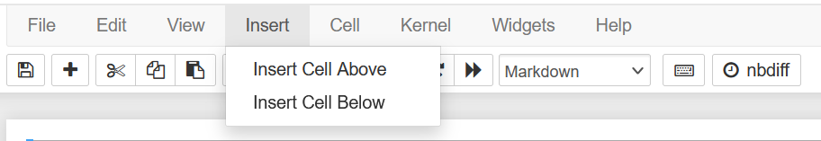
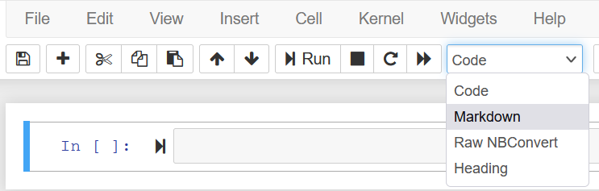
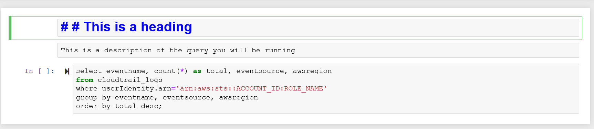
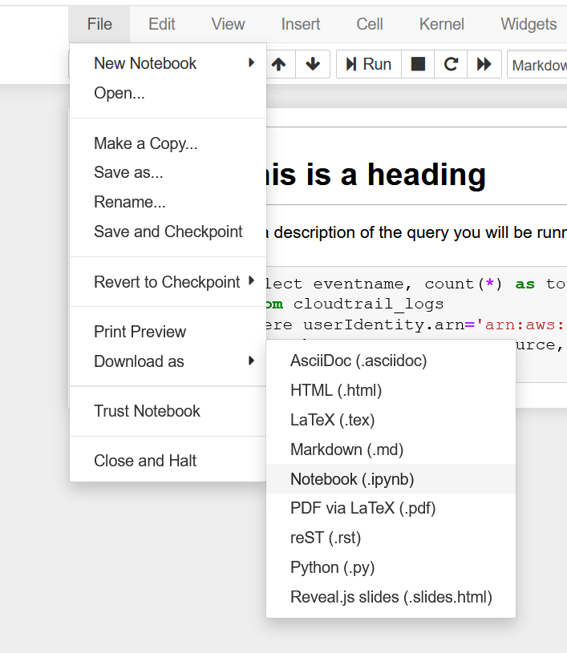

### Giới thiệu

Vì bạn đã xây dựng nhiều truy vấn SQL khác nhau để khám phá và phân tích sự cố, và xây dựng các cuộc gọi SDK Python bằng thư viện boto3 để kiểm soát sự cố, bạn bây giờ cần kết hợp tất cả điều này để tạo nên cơ sở của sổ tay quản lý rủi ro đầu tiên của bạn.

### Bước 1 - Xây dựng sổ tay quản lý rủi ro của bạn
Lấy các truy vấn khám phá từ hai cuộc điều tra bạn đã thực hiện và thêm chúng vào Jupyter notebook của bạn.

1. Từ Jupyter notebook của bạn, click vào "Insert" và chèn một ô mới

2. Từ menu thả xuống có nội dung "Code", hãy thay đổi loại ô thành "Markdown"

3. Đặt một số văn bản mô tả giải thích về truy vấn.
4. Thêm một ô phía dưới cái này.
5. Giữ định dạng ô này là "Code" và dán truy vấn liên quan bạn muốn sử dụng từ các điều tra trước.
6. Bây giờ, bạn có thể lặp lại những bước này để thêm các truy vấn và chú thích Markdown cho mỗi truy vấn.
7. Thêm tiêu đề để phân đoạn Jupyter notebook của bạn, bạn có thể làm điều này bằng cách thay đổi loại ô thành Markdown và đặt `##` trong ô để tạo một tiêu đề. Nó nên trông giống như thế này:

8. Sau khi bạn đã chạy qua tất cả các truy vấn SQL bạn muốn giữ lại và đã thêm tiêu đề và chú thích, hãy chạy qua sổ tay quản lý rủi ro của bạn để xác minh rằng các truy vấn SQL của bạn hoạt động. Hãy thoải mái khám phá ngoài phạm vi của các truy vấn bạn đã thực hiện cho đến nay.
9. Để giữ một bản sao của sổ hướng dẫn cá nhân của bạn, hãy điều hướng đến "File", "Download as", sau đó chọn "Notebook (.ipynb)". Bạn có thể tải xuống sổ tay của riêng bạn và sử dụng nó làm cơ sở cho những thay đổi trong tương lai.
