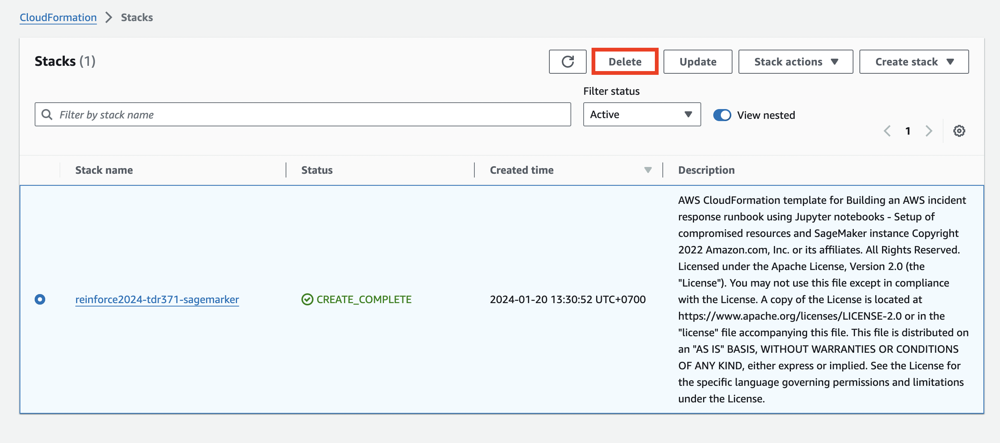
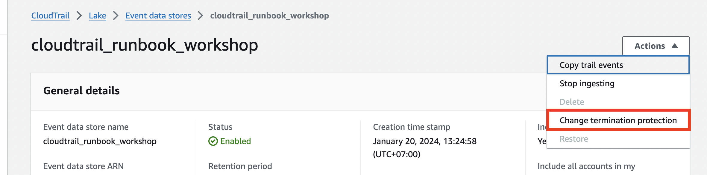
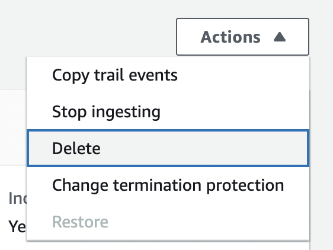
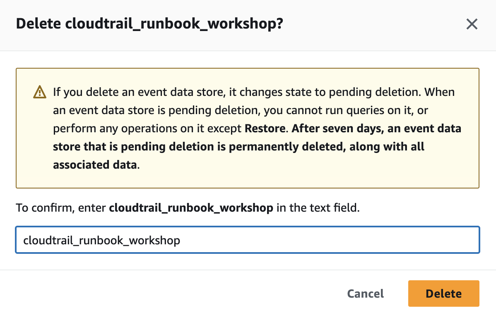

Sau khi bạn đã hoàn thành buổi workshop, bạn cần xóa tất cả các tài nguyên đã tạo. Hầu hết chúng sẽ được xóa bởi AWS CloudFormation, nhưng một số tài nguyên yêu cầu việc xóa thủ công.

{}
Nếu bạn đang sử dụng EventEngine, bạn không 
cần thực hiện các bước này vì việc xóa được thực hiện tự động.
{}

{}
Hãy đảm bảo bạn đã tải xuống Jupyter notebook của mình trước khi thực hiện bất kỳ xóa nào.
{}

1. Chuyển đến bảng điều khiển CloudFormation và xóa stack bạn đã tạo trong quá trình thiết lập.

2. Chuyển đến bảng điều khiển CloudTrail Lake và chọn tab **Event data stores**.
3. Nhấp vào tên của CloudTrail Lake event data store bạn đã tạo.
4. Chọn **Actions** ở mục thả xuống.
5. Nếu bạn không thể nhấp vào **Delete**, chọn **Change termination protection**, sau đó chọn nút radio **Disabled** và **Save**.

6. Chọn **Actions** ở mục thả xuống, sau đó chọn **Delete**.

7. Làm theo hướng dẫn và nhập tên của event data store. Sau đó chọn **Delete**.

8. Chuyển đến bảng điều khiển S3, làm trống và xóa bucket S3 đã tạo:
-  Data exfiltration bucket - Điều này sẽ có tên kết thúc bằng `<AWSAccountID>-us-east-1-data`

9. Chuyển đến bảng điều khiển EC2 và xóa snapshot của EBS volume bạn đã thực hiện trong quá trình điều tra
- Bạn có thể xác minh snapshot bằng cách kiểm tra thời gian "Started".
10. Chuyển đến bảng điều khiển VPC và xóa VPC có tên là `reinforce2021-tdr254`
11. Chuyển đến bảng điều khiển IAM và xóa tài khoản người dùng có tên là `migration_account`

Sau khi hoàn thành quá trình dọn dẹp, hãy xác minh rằng mẫu CloudFormation đã được xóa cùng với các tài nguyên trên để đảm bảo bạn không phải chịu thêm bất kỳ chi phí nào.